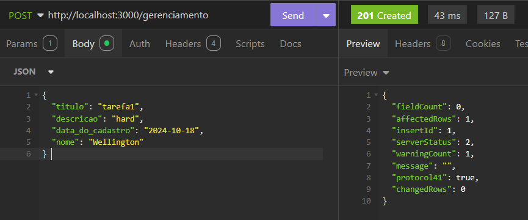

# VPF01-Tarefas

Projeto regido pelo Professor Lucas Paiva, produzido na matéria de BACKEND, com o objetivo de desenvolver uma API RESTful básica que permita criar, listar e deletar as tarefas.

_Produzido por Beatriz Vizeu._
